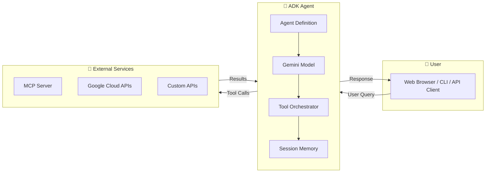
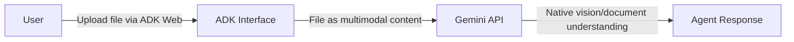

# Complete ADK Guide - Development, Deployment & Usage

**Google ADK (Agent Development Kit)**  
**Cognizant Technology Solutions**  
**Version 3.0 | January 2026**

---

## 📋 **Table of Contents**

1. [Overview](#overview)
2. [Development](#development)
3. [Deployment](#deployment)
4. [Usage After Deployment](#usage-after-deployment)
5. [Authentication](#authentication)
6. [Corporate Policies](#corporate-policies)
7. [Troubleshooting](#troubleshooting)
8. [Best Practices](#best-practices)

---

## 🎯 **Overview**

### **What is Google ADK?**

Google ADK (Agent Development Kit) is an **open-source framework** from Google for building sophisticated AI agents. It provides:

1. **A structured way to define agents** - Using Python classes with clear instructions, tools, and model configurations
2. **Built-in tool integration** - Native support for MCP (Model Context Protocol) servers, Google Cloud tools, and custom functions
3. **Multiple deployment targets** - Local development, Cloud Run (with UI), or Vertex AI Agent Engine (API-only)
4. **Session management** - Automatic conversation history and state tracking

> **Why ADK over raw Gemini API?**  
> While you can call Gemini directly, ADK provides the "glue code" for production agents: tool orchestration, memory management, error handling, and deployment infrastructure.

### **Key Features**

| Feature                    | Description                                                  |
| -------------------------- | ------------------------------------------------------------ |
| **Gemini Models**          | Access to Gemini 2.0 Flash, 2.5 Flash/Pro, and latest models |
| **MCP Integration**        | Connect to any MCP-compatible server for external tools      |
| **Multi-Agent Support**    | Build hierarchical agent teams with delegation               |
| **Interactive Interfaces** | CLI (`adk run`) and Web UI (`adk web`) for testing           |
| **Cloud Deployment**       | One-command deploy to Cloud Run or Agent Engine              |
| **Authentication**         | Built-in Google Cloud authentication (ADC)                   |

### **Architecture**

#### High-Level Flow



#### Component Breakdown

```
┌──────────────────────────────────────────────────────────────────────────┐
│                              ADK AGENT                                    │
├──────────────────────────────────────────────────────────────────────────┤
│                                                                          │
│  ┌─────────────────┐    ┌─────────────────┐    ┌─────────────────┐      │
│  │   Instruction   │    │   Gemini LLM    │    │   Tools         │      │
│  │                 │    │                 │    │                 │      │
│  │ "You are a     │───▶│ gemini-2.5-flash│───▶│ • MCP Toolset   │      │
│  │  helpful agent │    │                 │    │ • Google Search │      │
│  │  that can..."  │    │ Reasoning &     │    │ • Code Executor │      │
│  │                 │    │ Planning        │    │ • Custom Funcs  │      │
│  └─────────────────┘    └─────────────────┘    └────────┬────────┘      │
│                                                          │               │
│                                                          ▼               │
│                              ┌─────────────────────────────────────┐     │
│                              │         MCP Server (Remote)         │     │
│                              │  • PowerPoint Tools                 │     │
│                              │  • Database Queries                 │     │
│                              │  • File Operations                  │     │
│                              │  • Any Custom Capability            │     │
│                              └─────────────────────────────────────┘     │
│                                                                          │
└──────────────────────────────────────────────────────────────────────────┘
```

#### How a Request Flows

1. **User sends a message** → "Create a presentation about AI trends"
2. **Agent receives the request** → Instruction tells it how to behave
3. **LLM reasons about the task** → Decides which tools to call
4. **Tool calls are executed** → MCP server creates the presentation
5. **Results returned to LLM** → LLM formats the response
6. **User receives the answer** → "I've created your presentation. Here's the download link..."

#### Automatic Function Calling (AFC)

ADK leverages Gemini's **Automatic Function Calling (AFC)** feature to optimize multi-tool workflows.

**What AFC Does:**

| Without AFC                                        | With AFC                                            |
| -------------------------------------------------- | --------------------------------------------------- |
| Each tool call requires a round-trip to the client | Multiple tool calls execute in a single LLM request |
| Slower for multi-step tasks                        | Faster execution for chained operations             |
| More API calls                                     | Fewer API calls, lower latency                      |

**How it works:**

```
Traditional: User → LLM → Tool A → LLM → Tool B → LLM → Response
                    ↑________|        ↑________|
                    (round trip)      (round trip)

With AFC:    User → LLM → [Tool A → Tool B → Tool C] → Response
                          ↑_________________________|
                          (all in one LLM call, up to 10 tools)
```

**Default Limit:** AFC allows up to **10 sequential tool calls** per request to prevent infinite loops.

> [!TIP]
> You'll see `AFC is enabled with max remote calls: 10` in your logs - this is normal and indicates optimal performance.

### **Key Concepts**

#### The Agent Definition

Every ADK agent has these core components:

```python
from google.adk.agents import Agent

root_agent = Agent(
    model='gemini-2.5-flash',      # Which LLM to use
    name='my_agent',                # Identifier for logging/debugging
    description='...',              # Short description (for multi-agent)
    instruction='...',              # Detailed behavior instructions
    tools=[...],                    # Available tools (MCP, functions, etc.)
)
```

#### The `root_agent` Convention

ADK expects a variable named `root_agent` in your agent module. This is the entry point that ADK will use when running your agent:

```python
# __init__.py - MUST export root_agent
from .agent import root_agent
```

#### Tools: Extending Agent Capabilities

Tools give your agent the ability to take actions beyond text generation:

| Tool Type          | Use Case                        | Example                             |
| ------------------ | ------------------------------- | ----------------------------------- |
| **MCP Toolset**    | Connect to external MCP servers | PowerPoint, databases, file systems |
| **Function Tools** | Python functions in your code   | Custom calculations, API calls      |
| **Google Search**  | Web search grounding            | Real-time information lookup        |
| **Code Execution** | Run generated code              | Data analysis, calculations         |

> 📖 **Building MCP Servers?** This guide covers how to **connect ADK agents to MCP servers** (client-side). For building MCP servers themselves, see the [Complete MCP Guide](./Complete_MCP_Guide.md).

#### File Handling & Multimodal Inputs

ADK agents can process various file types (PDFs, images, documents) through Gemini's native multimodal capabilities. Here's how it works:

**How File Processing Works:**



1. **User Uploads Files** - Via `adk web` interface or API with file attachments
2. **Files Become Multimodal Content** - ADK converts uploads to `google.genai.types.Part` objects
3. **Gemini Processes Natively** - PDF/images are processed using Gemini's native vision capabilities
4. **No Manual Parsing Needed** - Gemini can "see" and analyze documents directly

**Supported File Types:**

| Type                           | Gemini Processing                | Notes                                       |
| ------------------------------ | -------------------------------- | ------------------------------------------- |
| **PDF**                        | Native vision (up to 1000 pages) | Text, images, charts, tables all understood |
| **Images** (PNG, JPEG, WebP)   | Native vision                    | Full image understanding                    |
| **Text files** (TXT, MD, HTML) | Extracted as text                | Formatting may be lost                      |
| **Other formats**              | Converted to text                | Charts/diagrams not preserved               |

> [!IMPORTANT] > **Key Insight:** When building agents that process documents, you don't need to implement file parsing manually. Gemini's native multimodal capabilities handle this automatically when files are uploaded through the ADK interface.

**Example: Document Processing Agent Tool**

```python
def analyze_document(file_path: str, query: str) -> str:
    """Analyze an uploaded document based on user query.

    The actual file content is automatically available to Gemini
    as multimodal input when uploaded via adk web interface.
    """
    prompt = f"""
    Analyze the document and answer this question: {query}
    Document reference: {file_path}
    """
    # Gemini can "see" the uploaded file content in its context
    response = client.models.generate_content(
        model="gemini-3-pro-preview",
        contents=prompt,
    )
    return response.text
```

**Artifacts for Large/Persistent Files:**

For scenarios requiring file persistence or handling very large files:

| Feature                     | Use Case                                   |
| --------------------------- | ------------------------------------------ |
| **InMemoryArtifactService** | Temporary storage during session           |
| **GcsArtifactService**      | Persistent storage in Google Cloud Storage |
| **Versioning**              | Track changes to artifacts over time       |

```python
# Saving an artifact in a tool
async def save_report(tool_context, report_data: bytes):
    artifact = types.Part.from_bytes(data=report_data, mime_type="application/pdf")
    await tool_context.save_artifact(filename="report.pdf", artifact=artifact)
```

> [!TIP]
> For production deployments, use `--artifact_service_uri='memory://'` with Cloud Run to handle artifacts without filesystem access issues.

---

## 🛠️ **Development**

### **Project Structure**

Every ADK agent follows a standard Python package structure. Understanding each file's role is critical:

```
my_agent/
├── agent.py                # Main ADK agent definition (REQUIRED)
├── prompt.py              # Agent instructions and behavior (recommended)
├── pyproject.toml         # Dependencies (REQUIRED for deployment)
├── .env                   # Environment variables (gitignored, local only)
└── __init__.py           # Package initialization (REQUIRED - exports root_agent)
```

| File             | Purpose                             | Why It Matters                                          |
| ---------------- | ----------------------------------- | ------------------------------------------------------- |
| `agent.py`       | Defines the agent, model, and tools | This is what ADK loads when you run `adk web` or deploy |
| `prompt.py`      | Contains instruction text           | Separating instructions makes them easier to iterate on |
| `pyproject.toml` | Lists dependencies                  | ADK uses this to install packages during deployment     |
| `.env`           | Local environment variables         | Never commit this! Contains API keys and URLs           |
| `__init__.py`    | Exports `root_agent`                | **Critical:** ADK looks for `root_agent` in this file   |

> [!IMPORTANT]
> The `__init__.py` file MUST export `root_agent`. This is how ADK discovers your agent:
>
> ```python
> # __init__.py
> from .agent import root_agent
> ```

### **Core Components**

#### **1. Agent Definition (agent.py)**

This is the heart of your ADK agent. Let's break down each part:

```python
import os
import subprocess
from google.adk.agents import Agent
from google.adk.tools.mcp_tool import McpToolset
from google.adk.tools.mcp_tool.mcp_session_manager import StreamableHTTPConnectionParams, StdioConnectionParams
from mcp.client.stdio import StdioServerParameters
```

**Why these imports?**

- `Agent` - The core class that wraps Gemini with tools and instructions
- `McpToolset` - Connects your agent to MCP servers (your external tools)
- `StreamableHTTPConnectionParams` - For production/cloud connections over HTTP
- `StdioConnectionParams` - For local development (spawns MCP server as subprocess)

---

#### **MCP Integration: Connecting to External Tools**

> 📖 **Note:** This section covers connecting ADK agents to MCP servers. For building MCP servers, see the [Complete MCP Guide](./Complete_MCP_Guide.md).

ADK supports two connection modes for MCP servers:

| Mode      | Transport       | Best For          | Connection Class                 |
| --------- | --------------- | ----------------- | -------------------------------- |
| **Stdio** | stdin/stdout    | Local development | `StdioConnectionParams`          |
| **HTTP**  | Streamable HTTP | Cloud deployment  | `StreamableHTTPConnectionParams` |

---

**Environment-based Configuration:**

```python
# Configuration from environment - makes the same code work locally AND in cloud
USE_HTTP = os.environ.get("USE_HTTP", "false").lower() == "true"
MCP_SERVER_URL = os.environ.get("MCP_SERVER_URL", "http://localhost:8080/mcp")
```

**Why use environment variables?**

- Your code stays the same between local development and cloud deployment
- Secrets (like URLs with tokens) stay out of your codebase
- You can change configuration without modifying code

---

##### **HTTP Mode (Cloud Run / Production)**

```python
if USE_HTTP:
    # For Cloud Run with authentication, fetch identity token via gcloud
    def get_identity_token() -> str:
        """Fetch Google ID token using gcloud CLI"""
        try:
            result = subprocess.run(
                ["gcloud", "auth", "print-identity-token"],
                capture_output=True, text=True, timeout=10
            )
            if result.returncode == 0:
                return result.stdout.strip()
            return None
        except Exception:
            return None

    token = get_identity_token()
    headers = {"Authorization": f"Bearer {token}"} if token else None

    mcp_connection = StreamableHTTPConnectionParams(
        url=MCP_SERVER_URL,
        timeout=120.0,
        headers=headers,  # Pass auth token for Cloud Run
    )
```

**What's happening here?**

1. **`get_identity_token()`** - Calls `gcloud auth print-identity-token` to get a Google ID token
2. **This token authenticates you** to Cloud Run services that require authentication (`--no-allow-unauthenticated`)
3. **The token is passed in headers** - Cloud Run validates it and allows the request
4. **`timeout=120.0`** - MCP operations (like creating presentations) can take time; 2 minutes is reasonable

> [!WARNING] > **Common Mistake:** Forgetting to grant `roles/run.invoker` on your MCP server to the calling service account. Without this, you'll get 403 Forbidden errors.

---

##### **Stdio Mode (Local Development)**

```python
else:
    # Local development - stdio transport (spawns server as subprocess)
    mcp_connection = StdioConnectionParams(
        server_params=StdioServerParameters(
            command='python',
            args=['server.py'],
            cwd='/path/to/mcp_server',
        ),
        timeout=120.0,
    )
```

**What's happening here?**

1. **ADK spawns your MCP server as a child process** - No need to run it separately
2. **Communication happens via stdin/stdout** - Fast, no network overhead
3. **Perfect for development** - Quick iteration, no deployment needed

> [!TIP]
> Use `StdioConnectionParams` during development, then switch to `StreamableHTTPConnectionParams` for cloud deployment. The toggle is just an environment variable (`USE_HTTP=true`).

---

**The Agent Definition:**

```python
# Define your agent
root_agent = Agent(
    model='gemini-2.5-flash',
    name='my_agent',
    description='Description of what your agent does',
    instruction='Your agent instructions here...',
    tools=[McpToolset(connection_params=mcp_connection)],
)
```

**Understanding each parameter:**

| Parameter     | Purpose                                     | Tips                                                                               |
| ------------- | ------------------------------------------- | ---------------------------------------------------------------------------------- |
| `model`       | Which Gemini model to use                   | `gemini-2.5-flash` is fast and capable; use `gemini-2.5-pro` for complex reasoning |
| `name`        | Identifier for logs and multi-agent         | Keep it short, lowercase, underscores                                              |
| `description` | Used when other agents delegate to this one | Important for multi-agent hierarchies                                              |
| `instruction` | The "system prompt" that guides behavior    | This is where most of your work goes!                                              |
| `tools`       | List of available tools                     | Can include `McpToolset`, functions, or built-in tools                             |

> [!IMPORTANT] > **The variable MUST be named `root_agent`!** ADK looks for this specific name when loading your agent.

---

##### **MCP Authentication Patterns**

> **Lessons Learned:** Getting Cloud Run authentication right is one of the most common pain points. Here's what we discovered:

> [!CAUTION] > **Critical Limitation:** `id_token.fetch_id_token()` from `google.oauth2` **DOES NOT WORK** with user credentials locally. It only works with:
>
> - Service accounts (Cloud Run, GCE, GKE)
> - Workload Identity Federation
>
> For local development connecting to Cloud Run MCP servers, use the `gcloud` CLI approach instead.

---

**Two Authentication Approaches:**

| Approach                      | Works Locally      | Works on Cloud Run           | Method                                                       |
| ----------------------------- | ------------------ | ---------------------------- | ------------------------------------------------------------ |
| **gcloud CLI**                | ✅ Yes             | ❌ No (gcloud not available) | `subprocess.run(["gcloud", "auth", "print-identity-token"])` |
| **id_token.fetch_id_token()** | ❌ No (user creds) | ✅ Yes (service account)     | `id_token.fetch_id_token(request, audience)`                 |

---

**For Local Development (Use gcloud CLI):**

```python
import subprocess

def get_identity_token() -> str:
    """Fetch ID token using gcloud CLI - works with user credentials"""
    try:
        result = subprocess.run(
            ["gcloud", "auth", "print-identity-token"],
            capture_output=True, text=True, timeout=10
        )
        if result.returncode == 0:
            return result.stdout.strip()
        return None
    except Exception:
        return None
```

**Prerequisites:**

```bash
# Authenticate yourself first
gcloud auth login
gcloud auth application-default login

# Grant yourself invoker access on the MCP server
gcloud run services add-iam-policy-binding YOUR_MCP_SERVICE \
  --member="user:your-email@domain.com" \
  --role="roles/run.invoker" \
  --region=us-central1
```

---

**For Cloud Run (Use id_token - service account credentials):**

```python
import google.auth.transport.requests
from google.oauth2 import id_token

def get_auth_token():
    """Fetch ID token - ONLY works with service account credentials"""
    try:
        request = google.auth.transport.requests.Request()
        return id_token.fetch_id_token(request, MCP_BASE_URL)
    except Exception as e:
        print(f"Warning: Could not fetch ID token: {e}")
        return None
```

**Cloud Run to Cloud Run (service-to-service):**

```bash
# Grant the calling service's service account access to the MCP server
gcloud run services add-iam-policy-binding YOUR_MCP_SERVICE \
  --member="serviceAccount:PROJECT_NUMBER-compute@developer.gserviceaccount.com" \
  --role="roles/run.invoker" \
  --region=us-central1
```

**For Agent Engine:** The service account is different - see the Agent Engine Deployment Guide.

#### **2. Agent Instructions (prompt.py)**

The instruction is **the most important part of your agent**. It's the "system prompt" that tells the LLM how to behave.

**Why separate into prompt.py?**

- Keeps agent.py clean (just wiring, not content)
- Easier to iterate on instructions without touching code
- Can import in other files if needed

**Structure your instructions clearly:**

```python
AGENT_INSTRUCTION = """
You are a helpful assistant that can [describe capabilities].

WORKFLOW:
1. First, call get_tools() to see available tools
2. Use appropriate tools to complete user requests
3. Provide clear responses with results

KEY RULES:
- Always verify tool outputs before responding
- Handle errors gracefully
- Ask for clarification when needed
"""
```

**Prompt Engineering Tips for ADK Agents:**

| Section            | Purpose                     | Example                                                       |
| ------------------ | --------------------------- | ------------------------------------------------------------- |
| **Identity**       | Who the agent is            | "You are a PowerPoint specialist..."                          |
| **Capabilities**   | What it can do              | "You can create, edit, and save presentations"                |
| **Workflow**       | Step-by-step process        | "1. Get assets 2. Create presentation 3. Add slides..."       |
| **Rules**          | Constraints and behaviors   | "Always use corporate branding", "Never skip slides"          |
| **Error Handling** | What to do when things fail | "If a tool fails, explain the error and suggest alternatives" |

> [!TIP] > **Be specific!** Vague instructions lead to unpredictable behavior. Write out exactly what you want the agent to do in common scenarios.

#### **3. Environment Configuration (.env)**

Create a `.env` file in your agent directory for local configuration:

```bash
# .env file (for local development - DO NOT COMMIT THIS!)
MCP_SERVER_URL=https://your-mcp-server.run.app/mcp
GOOGLE_API_KEY=your-api-key  # If using Google AI Studio
# OR for Vertex AI:
GOOGLE_CLOUD_PROJECT=your-project-id
GOOGLE_CLOUD_LOCATION=us-central1
```

**Variable explanations:**

| Variable                | When to Use                 | How to Get It                                                |
| ----------------------- | --------------------------- | ------------------------------------------------------------ |
| `MCP_SERVER_URL`        | Always (if using MCP tools) | Your deployed Cloud Run URL + `/mcp`                         |
| `GOOGLE_API_KEY`        | Using Gemini via AI Studio  | Create at [aistudio.google.com](https://aistudio.google.com) |
| `GOOGLE_CLOUD_PROJECT`  | Using Vertex AI             | Your GCP project ID                                          |
| `GOOGLE_CLOUD_LOCATION` | Using Vertex AI             | Usually `us-central1`                                        |

> [!IMPORTANT]
> Add `.env` to your `.gitignore` to avoid committing secrets!

---

### **Local Development Setup**

#### **1. Install uv and Google ADK**

[uv](https://github.com/astral-sh/uv) is a fast Python package manager. ADK recommends it.

```bash
# Install uv (if not already installed)
pip install uv

# Install ADK using uv
uv pip install google-adk

# Verify installation - should print version number
adk --version
```

**Why uv?**

- 10-100x faster than pip
- Better dependency resolution
- Works with existing pip workflows

---

#### **2. Project Setup**

Create your agent directory structure:

```bash
mkdir my_agent
cd my_agent
uv venv
source .venv/bin/activate  # On Windows: .venv\Scripts\activate

# Create the required __init__.py
# NOTE: This MUST export root_agent for ADK to find your agent!
echo "from .agent import root_agent" > __init__.py
```

**Why the `__init__.py` is critical:**

- ADK looks for `root_agent` variable when loading your agent
- Without this export, you'll get "root_agent not found" error

---

#### **3. Run Locally**

```bash
# Navigate to PARENT directory of your agent folder
# (ADK expects: current_dir/agent_folder/agent.py)
cd ..

# Run in CLI mode (text-based, good for testing)
adk run my_agent

# Or run with Web UI (recommended - better experience)
adk web
# Opens browser at http://localhost:8000
```

**CLI vs Web UI:**

| Mode   | Command            | Best For                       |
| ------ | ------------------ | ------------------------------ |
| CLI    | `adk run my_agent` | Quick testing, scripting       |
| Web UI | `adk web`          | Interactive testing, debugging |

---

## 🚀 **Deployment**

### **Key Variables**

Before deploying, set these environment variables:

```bash
export GOOGLE_CLOUD_PROJECT="your-gcp-project-id"   # Your GCP project ID
export GOOGLE_CLOUD_LOCATION="us-central1"          # GCP region
export SERVICE_NAME="my-agent-service"              # Cloud Run service name
export AGENT_PATH="./my_agent"                      # Path to your agent folder
```

> **Note**: `AGENT_PATH` should point to the directory containing your `agent.py` and `__init__.py` files.

---

### **ADK Deployment Options**

#### **1. Cloud Run Deployment (API Only)**

```bash
adk deploy cloud_run \
  --project=$GOOGLE_CLOUD_PROJECT \
  --region=$GOOGLE_CLOUD_LOCATION \
  --service_name=$SERVICE_NAME \
  $AGENT_PATH
```

#### **2. Cloud Run Deployment (with Web UI) — Recommended**

```bash
adk deploy cloud_run \
  --project=$GOOGLE_CLOUD_PROJECT \
  --region=$GOOGLE_CLOUD_LOCATION \
  --service_name=$SERVICE_NAME \
  --with_ui \
  --artifact_service_uri='memory://' \
  $AGENT_PATH \
  -- --set-env-vars="GOOGLE_CLOUD_PROJECT=$GOOGLE_CLOUD_PROJECT,GOOGLE_CLOUD_LOCATION=$GOOGLE_CLOUD_LOCATION,GOOGLE_API_KEY=$GOOGLE_API_KEY,MCP_SERVER_URL=https://your-mcp-server.run.app/mcp"
```

> ⚠️ **Critical**: The `--artifact_service_uri='memory://'` flag is **required** for `--with_ui` deployments. Cloud Run has a read-only filesystem, and without this flag ADK fails trying to create `.adk/artifacts`.

#### **3. Agent Engine Deployment (Vertex AI)**

```bash
adk deploy agent_engine \
  --project=$GOOGLE_CLOUD_PROJECT \
  --region=$GOOGLE_CLOUD_LOCATION \
  --staging_bucket="gs://your-staging-bucket" \
  --display_name="My Agent" \
  $AGENT_PATH
```

---

### **ADK Deploy Options Reference**

| Flag                     | Required | Description                                                  |
| ------------------------ | -------- | ------------------------------------------------------------ |
| `--project`              | Yes      | GCP project ID                                               |
| `--region`               | Yes      | GCP region (e.g., `us-central1`)                             |
| `AGENT_PATH`             | Yes      | Path to agent directory (positional argument)                |
| `--service_name`         | No       | Cloud Run service name (default: `adk-default-service-name`) |
| `--with_ui`              | No       | Deploy with ADK Web UI                                       |
| `--artifact_service_uri` | No\*     | Artifact storage (`memory://` required with `--with_ui`)     |
| `--port`                 | No       | Service port (default: `8000`)                               |

### **Post-Deployment Setup (REQUIRED)**

#### **1. Set IAM Permissions (Cloud Run Invoker)**

> [!CAUTION] > **This step is REQUIRED!** Without it, you will get `403 Forbidden` when accessing the deployed agent in your browser.

After deployment, you must grant access permissions. The approach depends on your organization's policies:

**Option A: Public Access (if allowed by org policy)**

```bash
gcloud run services add-iam-policy-binding $SERVICE_NAME \
  --region=$GOOGLE_CLOUD_LOCATION \
  --project=$GOOGLE_CLOUD_PROJECT \
  --member="allUsers" \
  --role="roles/run.invoker"
```

> ⚠️ **Note**: Many corporate environments block `allUsers` due to organization policies. If you see:
>
> ```
> ERROR: FAILED_PRECONDITION: One or more users named in the policy do not belong
> to a permitted customer, perhaps due to an organization policy.
> ```
>
> Use **Option B** instead (this is the most common case in corporate environments).

**Option B: Specific Users/Groups (Corporate Environment) — Recommended**

```bash
# Grant access to your user account (REQUIRED for browser access)
gcloud run services add-iam-policy-binding $SERVICE_NAME \
  --region=$GOOGLE_CLOUD_LOCATION \
  --project=$GOOGLE_CLOUD_PROJECT \
  --member="user:your-email@your-domain.com" \
  --role="roles/run.invoker"
```

**Option C: Domain-Wide Access**

```bash
# Grant access to all users in your Google Workspace domain
gcloud run services add-iam-policy-binding $SERVICE_NAME \
  --region=$GOOGLE_CLOUD_LOCATION \
  --project=$GOOGLE_CLOUD_PROJECT \
  --member="domain:your-domain.com" \
  --role="roles/run.invoker"
```

#### **2. Verify IAM Permissions**

```bash
gcloud run services get-iam-policy $SERVICE_NAME \
  --region=$GOOGLE_CLOUD_LOCATION \
  --project=$GOOGLE_CLOUD_PROJECT
```

#### **3. Configure Environment Variables (Optional)**

```bash
gcloud run services update $SERVICE_NAME \
  --region=$GOOGLE_CLOUD_LOCATION \
  --project=$GOOGLE_CLOUD_PROJECT \
  --set-env-vars="MCP_SERVER_URL=https://your-mcp-server.run.app/mcp"
```

**Understanding Environment Variables:**

| Variable                | Description         | Why Required?                                                       |
| ----------------------- | ------------------- | ------------------------------------------------------------------- |
| `GOOGLE_CLOUD_PROJECT`  | GCP project ID      | Used by Google libraries for logging, tracing, and auth validation. |
| `GOOGLE_CLOUD_LOCATION` | GCP region          | Used to initialize regional Vertex/Cloud resources defaults.        |
| `GOOGLE_API_KEY`        | Gemini API key      | **Required** if using Gemini Developer API (default).               |
| `MCP_SERVER_URL`        | MCP server endpoint | URL of the deployed Cloud Run MCP service.                          |

> **Note:** If you switch to **Vertex AI** (`GOOGLE_GENAI_USE_VERTEXAI=true`), the `GOOGLE_API_KEY` becomes optional as IAM permissions are used instead.

#### **4. Service-to-Service Authentication (Agent → MCP Server)**

When your agent calls an MCP server on Cloud Run, you need to grant the agent's service account `run.invoker` on the MCP server:

```bash
# Find the compute service account (used by default for Cloud Run)
# Format: PROJECT_NUMBER-compute@developer.gserviceaccount.com

# Grant the agent permission to call MCP server
gcloud run services add-iam-policy-binding YOUR_MCP_SERVER \
  --region=$GOOGLE_CLOUD_LOCATION \
  --project=$GOOGLE_CLOUD_PROJECT \
  --member="serviceAccount:PROJECT_NUMBER-compute@developer.gserviceaccount.com" \
  --role="roles/run.invoker"
```

> **Important:** Cloud Run does **NOT** automatically inject authentication tokens into HTTP requests made by your application code. You must explicitly fetch an identity token and include it in the `Authorization` header.
>
> **Implementation Pattern (in `agent.py`):**
>
> ```python
> import google.auth.transport.requests
> from google.oauth2 import id_token
>
> # 1. Get the base URL (audience)
> MCP_AUDIENCE = "https://your-mcp-server.run.app"
>
> # 2. Fetch ID token (works on Cloud Run & Local with ADC)
> def get_auth_token():
>     request = google.auth.transport.requests.Request()
>     return id_token.fetch_id_token(request, MCP_AUDIENCE)
>
> # 3. Pass to connection params
> mcp_connection = StreamableHTTPConnectionParams(
>     url=MCP_SERVER_URL,
>     headers={"Authorization": f"Bearer {get_auth_token()}"}
> )
> ```
>
> **Dependencies:**
> Ensure `google-auth` is in your `pyproject.toml` or `requirements.txt`.

## 🏢 **Enterprise Deployment Options**

Corporate environments often have restrictions that block standard OAuth/IAM browser authentication. Here are proven solutions:

### **Option 1: Identity-Aware Proxy (IAP) — Recommended for Browser Access**

> [!TIP]
> As of April 2025, Cloud Run has **direct IAP integration** - no load balancer needed! This is the simplest way to add Google sign-in to your deployed agent.

#### **Enable IAP via Cloud Console UI:**

1. Go to **Cloud Console** → **Cloud Run** → Click on your service
2. Click the **Security** tab
3. Enable **"Advanced authentication with Identity-Aware Proxy (IAP)"**
4. Click **"Edit Policy"** to add users:
   - Click **"+ Add Principal"**
   - Enter email (e.g., `user@your-domain.com`) or domain (e.g., `your-domain.com`)
   - Role **"IAP-secured Web App User"** is auto-assigned
5. Click **Save**

#### **Enable IAP via CLI:**

```bash
# Enable IAP API
gcloud services enable iap.googleapis.com --project=$GOOGLE_CLOUD_PROJECT

# Add IAP policy binding
gcloud iap web add-iam-policy-binding \
  --resource-type=cloud-run \
  --service=$SERVICE_NAME \
  --region=$GOOGLE_CLOUD_LOCATION \
  --member="user:your-email@your-domain.com" \
  --role="roles/iap.httpsResourceAccessor" \
  --project=$GOOGLE_CLOUD_PROJECT
```

**After enabling IAP:**

- Your Cloud Run URL will show a **Google sign-in page**
- Only users with the **IAP-secured Web App User** role can access
- No more 403 Forbidden errors!

**Best for:** Browser-based access with Google sign-in

#### **Terminal/CLI Access with IAP**

IAP is designed for browser sign-in. For terminal access to IAP-protected services, use the **Cloud Run Proxy**:

```bash
# Start the proxy - handles auth automatically
gcloud run services proxy $SERVICE_NAME \
  --region=$GOOGLE_CLOUD_LOCATION \
  --project=$GOOGLE_CLOUD_PROJECT \
  --port=8080

# Access locally - no token needed
curl http://127.0.0.1:8080
```

> **Note:** Direct `curl` access to IAP-protected URLs requires service account impersonation with `roles/iam.serviceAccountTokenCreator`, which may not be available in all corporate environments.

---

### **Option 2: API Gateway (Programmatic Access)**

Put Cloud API Gateway in front of Cloud Run for JWT-based auth:

```yaml
# api-config.yaml
swagger: "2.0"
info:
  title: ADK Agent API
  version: "1.0"
host: "your-api-gateway.apigateway.PROJECT.cloud.goog"
securityDefinitions:
  jwt_auth:
    type: "oauth2"
    x-google-issuer: "https://your-corporate-idp.com"
    x-google-jwks_uri: "https://your-corporate-idp.com/.well-known/jwks.json"
paths:
  /agent:
    post:
      security:
        - jwt_auth: []
      x-google-backend:
        address: https://my-agent-service-xxx.run.app
```

```bash
# Deploy API Gateway
gcloud api-gateway gateways create my-agent-gateway \
  --api=my-agent-api \
  --api-config=api-config \
  --location=us-central1
```

**Best for:** API-only access, agent-to-agent, or programmatic calls

---

### **Option 3: VPC + Internal Load Balancer (Fully Private)**

Deploy within corporate VPC with no public internet exposure:

```bash
# Step 1: Create VPC connector
gcloud compute networks vpc-access connectors create my-vpc-connector \
  --region=us-central1 \
  --network=default \
  --range=10.8.0.0/28

# Step 2: Deploy with internal-only ingress
gcloud run deploy my-agent-service \
  --image gcr.io/$PROJECT_ID/my-agent \
  --region=us-central1 \
  --ingress=internal \
  --vpc-connector=my-vpc-connector \
  --allow-unauthenticated  # Auth handled by VPC access control
```

**Access pattern:**

```
Corporate User → VPN → VPC → Internal LB → Cloud Run
```

**Best for:** Highly secure, internal-only access

---

### **Option 4: Vertex AI Agent Engine (Fully Managed)**

For API-only deployment with managed authentication:

```bash
adk deploy agent_engine \
  --project=$GOOGLE_CLOUD_PROJECT \
  --region=$GOOGLE_CLOUD_LOCATION \
  --staging_bucket="gs://your-staging-bucket" \
  --display_name="My Enterprise Agent" \
  ./my_agent
```

**Access via API:**

```python
from vertexai.agents import Agent

# IAM-controlled access, no browser login needed
agent = Agent.from_deployed("projects/PROJECT/locations/REGION/agents/AGENT_ID")
response = agent.chat("Hello")
```

**Best for:** Quickest setup, API-only access, auto-scaling

---

### **Comparison: Which to Choose?**

| Requirement          | Recommended Solution        |
| -------------------- | --------------------------- |
| Web UI for end users | IAP + Corporate IdP         |
| API access only      | API Gateway or Agent Engine |
| No public internet   | VPC + Internal LB           |
| Quickest setup       | Vertex AI Agent Engine      |
| Full control         | VPC + GKE                   |

---

## ✅ **Usage After Deployment**

### **1. API Access (Deployed ADK Agent)**

#### **Check Deployment Status**

```bash
gcloud run services describe my-agent-service --region=us-central1
```

#### **Test API**

```bash
# Get authentication token
TOKEN=$(gcloud auth print-identity-token)

# Test health endpoint
curl -H "Authorization: Bearer $TOKEN" \
  https://my-agent-service-xxxx.run.app/health
```

### **2. Local ADK Interface (Recommended for Development)**

#### **CLI Interface**

```bash
cd parent_folder
adk run my_agent

# Example conversation:
# [user]: Help me with a task
# [my_agent]: I'll help you with that...
```

#### **Web Interface**

```bash
adk web
# Open browser: http://localhost:8000
# Select your agent from the dropdown
```

---

## 🔐 **Authentication**

### **How ADK Handles Authentication**

ADK automatically handles authentication for Cloud Run services using **Application Default Credentials (ADC)**:

1. **Local development**: Uses your `gcloud auth application-default login` credentials
2. **Cloud Run**: Uses the service account attached to the Cloud Run instance
3. **Identity tokens**: Automatically generated and refreshed for Cloud Run URLs

### **Setup Authentication**

```bash
# For local development
gcloud auth application-default login

# Verify your credentials
gcloud auth list

# Test identity token generation
gcloud auth print-identity-token
```

### **Authentication Flow**

1. ADK detects Cloud Run URL in configuration
2. Uses Application Default Credentials (ADC)
3. Generates identity token for the target service
4. Adds Authorization header to requests automatically
5. Refreshes tokens before expiration

---

## 🏢 **Corporate Policies**

### **Organizational Restrictions**

Some organizations have policies that may affect ADK deployment:

| Access Method        | Authentication  | Status               |
| -------------------- | --------------- | -------------------- |
| **Local ADK CLI**    | Auto via gcloud | ✅ **WORKS**         |
| **Local ADK Web**    | Auto via gcloud | ✅ **WORKS**         |
| **Deployed Web UI**  | Requires IAM    | ⚠️ May be restricted |
| **Direct API calls** | Identity token  | ✅ **WORKS**         |

### **Recommended Usage Pattern**

```
You (Browser) → ADK Local Web → Cloud MCP Server
```

- ✅ Local web interface (bypasses browser restrictions)
- ✅ Cloud backend (deployed MCP server with auth)
- ✅ Automatic authentication via ADK

---

## 🔧 **Troubleshooting**

This section covers common issues we encountered while building and deploying ADK agents, with detailed solutions from real experience.

### **Common Issues**

#### **1. Agent Won't Connect to MCP Server**

> 📖 **Server-side issues?** If your MCP server isn't starting or has errors, see the [Complete MCP Guide - Troubleshooting](./Complete_MCP_Guide.md#troubleshooting).

**Symptoms:**

- Agent says "I don't have any tools available"
- Error: "Connection refused" or "Failed to connect to MCP server"

**Diagnosis & Fix:**

```bash
# Step 1: Check if MCP_SERVER_URL is set correctly
echo $MCP_SERVER_URL
# Should output: https://your-mcp-server-xxx.run.app/mcp

# Step 2: Test if MCP server is accessible
TOKEN=$(gcloud auth print-identity-token)
curl -H "Authorization: Bearer $TOKEN" \
  https://your-mcp-server.run.app/health

# Expected: {"status": "healthy", ...}
# If 403 → IAM permission issue (see below)
# If connection refused → Server not running or wrong URL
```

**Common fixes:**

| Issue                     | Solution                                   |
| ------------------------- | ------------------------------------------ |
| Missing `/mcp` in URL     | Add `/mcp` to the end of your server URL   |
| HTTP instead of HTTPS     | Use `https://` for Cloud Run URLs          |
| USE_HTTP not true locally | Set `USE_HTTP=true` when testing HTTP mode |

---

#### **2. Authentication Errors (403 Forbidden)**

**Symptoms:**

```
HTTP Error 403: Your client does not have permission to get URL
```

**This is almost always an IAM issue.** Here's how to fix it:

```bash
# Step 1: Re-authenticate your local environment
gcloud auth application-default login

# Step 2: Verify you're logged in
gcloud auth list
# Should show your email with a * (active)

# Step 3: Grant yourself access to the MCP server
gcloud run services add-iam-policy-binding YOUR_MCP_SERVER \
  --region=$GOOGLE_CLOUD_LOCATION \
  --member="user:your-email@domain.com" \
  --role="roles/run.invoker"

# Step 4: Test again
curl -H "Authorization: Bearer $(gcloud auth print-identity-token)" \
  https://your-mcp-server.run.app/health
```

**For service-to-service (Cloud Run agent → Cloud Run MCP):**

```bash
# The agent's Cloud Run service uses the compute service account by default
PROJECT_NUMBER=$(gcloud projects describe $GOOGLE_CLOUD_PROJECT --format='value(projectNumber)')

gcloud run services add-iam-policy-binding YOUR_MCP_SERVER \
  --region=$GOOGLE_CLOUD_LOCATION \
  --member="serviceAccount:${PROJECT_NUMBER}-compute@developer.gserviceaccount.com" \
  --role="roles/run.invoker"
```

---

#### **3. Deployment Failures**

**Symptoms:**

- `adk deploy cloud_run` hangs or fails
- Service deploys but crashes immediately

**Diagnosis:**

```bash
# Step 1: Check deployment logs
gcloud logging read "resource.type=cloud_run_revision AND resource.labels.service_name=my-agent-service" --limit=50

# Step 2: Or use real-time log tailing
gcloud run services logs tail my-agent-service --region=us-central1

# Step 3: Verify your project and permissions
gcloud config list
gcloud projects get-iam-policy $GOOGLE_CLOUD_PROJECT --filter="bindings.members:$(gcloud config get-value account)"
```

**Common deployment issues:**

| Error                   | Cause                                     | Solution                                      |
| ----------------------- | ----------------------------------------- | --------------------------------------------- |
| "No `root_agent` found" | `__init__.py` doesn't export `root_agent` | Add `from .agent import root_agent`           |
| Module import failures  | Missing dependency in `pyproject.toml`    | Add missing package to dependencies           |
| Container crashes       | Code error at startup                     | Check logs for stack trace, fix Python errors |
| `--with_ui` crashes     | Missing artifact service                  | Add `--artifact_service_uri='memory://'`      |

---

#### **4. "root_agent Not Found" Error**

**Symptoms:**

```
Error: Could not find 'root_agent' in the agent module
```

**The most common cause:** Your `__init__.py` doesn't export the agent.

**Fix:**

```python
# __init__.py - MUST have this line
from .agent import root_agent
```

---

#### **5. Token/Authentication Issue in Cloud Run**

**Symptoms:**

- Agent works locally but fails in Cloud Run
- MCP tools timeout or return auth errors

**Cause:** Cloud Run doesn't automatically inject tokens for outbound HTTP requests.

**Fix in your agent.py:**

```python
import google.auth.transport.requests
from google.oauth2 import id_token

def get_auth_token():
    """Fetch ID token - works on Cloud Run and locally with ADC"""
    try:
        request = google.auth.transport.requests.Request()
        return id_token.fetch_id_token(request, MCP_BASE_URL)  # Base URL, not /mcp
    except Exception as e:
        print(f"Warning: Could not fetch ID token: {e}")
        return None

# Use the token in your connection params
token = get_auth_token()
mcp_connection = StreamableHTTPConnectionParams(
    url=MCP_SERVER_URL,
    headers={"Authorization": f"Bearer {token}"} if token else None,
)
```

---

### **Debug Commands**

```bash
# ADK verbose mode - shows detailed execution info
adk run my_agent --verbose

# Check ADK version
adk --version

# Check service status
gcloud run services describe my-agent-service --region=us-central1

# Check service logs
gcloud run services logs tail my-agent-service --region=us-central1

# Test your agent locally before deploying
adk web  # Then open http://localhost:8000
```

---

## 📋 **Best Practices**

These are lessons learned from real-world experience building and deploying ADK agents.

### **Development**

| Practice                           | Why It Matters                                            | How to Do It                                            |
| ---------------------------------- | --------------------------------------------------------- | ------------------------------------------------------- |
| **Test locally first**             | Catch errors before deployment, faster iteration          | Run `adk web` before every `adk deploy`                 |
| **Use environment variables**      | Same code works everywhere, secrets stay secure           | Put config in `.env`, read with `os.environ.get()`      |
| **Keep instructions clear**        | LLM follows instructions precisely; vague = unpredictable | Write step-by-step workflows in your prompt             |
| **Handle MCP failures gracefully** | Network issues happen; agents shouldn't crash             | Wrap MCP calls in try/catch, provide fallback responses |
| **Use descriptive names**          | Helps debugging and multi-agent orchestration             | `PowerPoint_Agent` not `agent1`                         |

> [!TIP] > **Prompt Engineering Tip:** Structure your agent instructions with clear sections:
>
> - What the agent is and does
> - Step-by-step workflow
> - Rules and constraints
> - Error handling guidance

---

### **Deployment**

| Practice                                     | Why It Matters                           | Example                                            |
| -------------------------------------------- | ---------------------------------------- | -------------------------------------------------- |
| **Always specify required flags**            | Avoid deployment to wrong project/region | `--project=$PROJECT --region=$REGION`              |
| **Set proper IAM permissions**               | 403 errors are the #1 deployment issue   | Grant `roles/run.invoker` immediately after deploy |
| **Use `--no-allow-unauthenticated`**         | Security! Don't expose agents publicly   | Add IAM for specific users instead                 |
| **Set environment variables at deploy**      | Config shouldn't be hardcoded            | `--set-env-vars="MCP_SERVER_URL=..."`              |
| **Use `--artifact_service_uri='memory://'`** | Required for `--with_ui` on Cloud Run    | Cloud Run filesystem is read-only                  |

---

### **Security**

| Practice                                          | Why It Matters                             | How to Do It                            |
| ------------------------------------------------- | ------------------------------------------ | --------------------------------------- |
| **Never commit credentials**                      | Leaks API keys to version control          | Add `.env` to `.gitignore`              |
| **Use service accounts with minimal permissions** | Principle of least privilege               | Only grant what's needed                |
| **Enable authentication on Cloud Run**            | Prevent unauthorized access                | Always use `--no-allow-unauthenticated` |
| **Rotate API keys periodically**                  | Limits damage if keys are compromised      | Set calendar reminders                  |
| **Use IAP for browser access**                    | Proper Google sign-in instead of 403 hacks | Enable IAP in Cloud Console             |

> [!WARNING] > **Never put API keys in your agent code!** Use environment variables:
>
> ```python
> # ❌ BAD - key in code
> GOOGLE_API_KEY = "AIza..."
>
> # ✅ GOOD - from environment
> GOOGLE_API_KEY = os.environ.get("GOOGLE_API_KEY")
> ```

---

### **Performance**

| Practice                       | Why It Matters                                  | Recommended Value                        |
| ------------------------------ | ----------------------------------------------- | ---------------------------------------- |
| **Set appropriate timeouts**   | MCP tools can take time (file generation, etc.) | 120-300 seconds                          |
| **Use correct model for task** | `flash` is fast, `pro` is smarter               | `gemini-2.5-flash` for most cases        |
| **Monitor cold starts**        | First request is slow on Cloud Run              | Consider min-instances=1 for production  |
| **Watch token expiration**     | Stale tokens cause auth failures                | Fetch fresh token per request or use ADC |

---

## 📎 **Appendix**

### **Local Development with stdio**

For local development, you can use stdio mode to spawn the MCP server as a subprocess:

```python
import os
import sys
from pathlib import Path
from google.adk.agents.llm_agent import Agent
from google.adk.tools.mcp_tool.mcp_toolset import McpToolset
from google.adk.tools.mcp_tool.mcp_session_manager import StdioConnectionParams
from mcp.client.stdio import StdioServerParameters

# Path to MCP server
project_root = Path(__file__).parent.parent
server_path = project_root / "ppt_mcp_server"

venv_python = server_path / ".venv" / "bin" / "python"
python_exec = str(venv_python) if venv_python.exists() else sys.executable

env = os.environ.copy()
if venv_python.exists():
    env["PATH"] = str(venv_python.parent) + ":" + env.get("PATH", "")

mcp_connection = StdioConnectionParams(
    server_params=StdioServerParameters(
        command=python_exec,
        args=[str(server_path / 'server.py')],
        env=env,
        cwd=str(server_path),
    ),
    timeout=120.0,
)

root_agent = Agent(
    model='gemini-3-pro-preview',
    name='My_Agent',
    instruction='...',
    tools=[McpToolset(connection_params=mcp_connection)],
)
```

**Requirements:** The MCP server must be in a sibling directory with its own virtual environment.

---

### **Identity Token Authentication**

When running an agent locally but connecting to a Cloud Run MCP server with authentication enabled, you need to manually fetch an identity token:

```python
import os
import subprocess
from google.adk.tools.mcp_tool.mcp_session_manager import StreamableHTTPConnectionParams

MCP_SERVER_URL = os.environ.get("MCP_SERVER_URL")

def get_identity_token() -> str:
    """Fetch Google ID token using gcloud CLI"""
    try:
        result = subprocess.run(
            ["gcloud", "auth", "print-identity-token"],
            capture_output=True,
            text=True,
            timeout=10
        )
        if result.returncode == 0:
            return result.stdout.strip()
        return None
    except Exception:
        return None

token = get_identity_token()
headers = {"Authorization": f"Bearer {token}"} if token else None

mcp_connection = StreamableHTTPConnectionParams(
    url=MCP_SERVER_URL,
    timeout=120.0,
    headers=headers,
)
```

**Prerequisites:**

- `gcloud auth login` completed
- User has `roles/run.invoker` on the MCP server service

**Note:** Cloud Run service-to-service calls don't need this - IAM handles auth automatically when both services are in the same project.

---

**Last Updated**: January 03, 2026  
**Author**: Ankit Goel (2179009) | ankit.goel@cognizant.com
