# Complete MCP Guide - Development, Deployment & Usage

**Model Context Protocol (MCP) Server**  
**Cognizant Technology Solutions**  
**Version 3.0 | January 2026**

---

## 📋 **Table of Contents**

1. [Overview](#overview)
2. [Development](#development)
3. [Deployment](#deployment)
4. [Usage After Deployment](#usage-after-deployment)
5. [Authentication](#authentication)
6. [Troubleshooting](#troubleshooting)
7. [Best Practices](#best-practices)

---

## 🎯 **Overview**

> 📖 **Building an ADK Agent?** This guide covers building MCP servers (the tools). For connecting ADK agents to MCP servers, see the [Complete ADK Guide](./Complete_ADK_Guide.md#mcp-integration-connecting-to-external-tools).

### **What is MCP?**

**Model Context Protocol (MCP)** is an **open standard** created by Anthropic that provides a universal interface for connecting AI models to external tools, data sources, and capabilities.

> **Think of it as "the USB-C port for AI"** - just as USB-C standardized how devices connect, MCP standardizes how LLMs connect to tools.

#### Why MCP Matters

Before MCP, every AI tool integration was custom:

- Each LLM platform had different function calling formats
- Tool developers built separate integrations for each AI system
- Code couldn't be reused between Claude, Gemini, ChatGPT, etc.

**MCP solves this** by providing a single standard that works everywhere.

### **MCP vs Traditional APIs**

| Traditional API           | MCP Server                            |
| ------------------------- | ------------------------------------- |
| You write code to call it | LLM decides when to call it           |
| Fixed input/output format | Schema auto-generated from type hints |
| No context about AI usage | Designed for AI interaction           |
| Manual error handling     | Structured error responses            |
| No conversation state     | Session-aware context                 |

### **MCP Server Capabilities**

MCP servers expose three types of capabilities to AI agents:

| Capability    | Description                                   | Example                                 |
| ------------- | --------------------------------------------- | --------------------------------------- |
| **Tools**     | Functions the LLM can call to perform actions | `create_presentation(title, slides)`    |
| **Resources** | Read-only data the LLM can access             | `config://settings`, `file://data.json` |
| **Prompts**   | Reusable prompt templates                     | `summarize_document(doc_type)`          |

### **Architecture**

#### High-Level Flow


#### Component Architecture

```mermaid
flowchart TB
    subgraph Client["🤖 MCP Client (ADK Agent)"]
        direction TB
        Agent[ADK Agent]
        McpToolset[McpToolset]
        Connection[Connection Params]
        Agent --> McpToolset
        McpToolset --> Connection
    end

    subgraph Transport["📡 Transport Layer"]
        HTTP[Streamable HTTP<br/>Production / Cloud]
        STDIO[Stdio<br/>Local Development]
    end

    subgraph Server["🔧 MCP Server (FastMCP)"]
        direction TB
        FastMCP[FastMCP Framework]
        Tools["@mcp.tool<br/>Functions"]
        Resources["@mcp.resource<br/>Data"]
        Prompts["@mcp.prompt<br/>Templates"]
        FastMCP --> Tools
        FastMCP --> Resources
        FastMCP --> Prompts
    end

    subgraph Backend["💾 Backend Systems"]
        DB[(Database)]
        Files[File System]
        APIs[External APIs]
    end

    Connection --> HTTP
    Connection --> STDIO
    HTTP --> FastMCP
    STDIO --> FastMCP
    Tools --> Backend
```



#### Detailed Component Breakdown

```
┌────────────────────────────────────────────────────────────────────────────┐
│                            MCP ARCHITECTURE                                 │
├────────────────────────────────────────────────────────────────────────────┤
│                                                                            │
│  ┌─────────────────────────────┐         ┌─────────────────────────────┐  │
│  │      MCP CLIENT             │         │       MCP SERVER            │  │
│  │      (ADK Agent)            │         │       (FastMCP)             │  │
│  │                             │         │                             │  │
│  │  • Discovers available      │  MCP    │  • Exposes tools, resources │  │
│  │    tools from server        │ Protocol│  • Handles tool execution   │  │
│  │  • Formats tool calls       │◄───────►│  • Returns structured data  │  │
│  │  • Handles responses        │         │  • Manages sessions         │  │
│  │                             │         │                             │  │
│  └─────────────────────────────┘         └─────────────────────────────┘  │
│                                                                            │
│  Transport Options:                                                        │
│  ┌─────────────────────────────────────────────────────────────────────┐  │
│  │                                                                      │  │
│  │   STDIO (Local)              │    Streamable HTTP (Cloud)           │  │
│  │   ─────────────              │    ────────────────────────          │  │
│  │   • Agent spawns server      │    • Server runs independently       │  │
│  │   • Direct process I/O       │    • HTTP POST to /mcp endpoint      │  │
│  │   • Best for development     │    • Supports authentication         │  │
│  │   • No network required      │    • Scalable, production-ready      │  │
│  │                              │                                       │  │
│  └─────────────────────────────────────────────────────────────────────┘  │
│                                                                            │
└────────────────────────────────────────────────────────────────────────────┘
```

### **How MCP Tools Work**

When you decorate a Python function with `@mcp.tool`:

1. **FastMCP inspects the function** - reads parameters, type hints, docstring
2. **Generates JSON schema** - creates a machine-readable tool definition
3. **Exposes to clients** - agents discover the tool and its schema
4. **LLM can invoke it** - by generating a tool call with proper arguments
5. **Server executes** - your Python function runs, returns result

```python
@mcp.tool
async def calculate_roi(investment: float, returns: float) -> dict:
    """Calculate return on investment percentage.

    Args:
        investment: Initial investment amount in dollars
        returns: Final returns amount in dollars

    Returns:
        Dictionary with ROI percentage and profit
    """
    profit = returns - investment
    roi = (profit / investment) * 100
    return {"roi_percent": roi, "profit": profit}
```

**Auto-generated schema:**

```json
{
  "name": "calculate_roi",
  "description": "Calculate return on investment percentage.",
  "inputSchema": {
    "type": "object",
    "properties": {
      "investment": {
        "type": "number",
        "description": "Initial investment amount in dollars"
      },
      "returns": {
        "type": "number",
        "description": "Final returns amount in dollars"
      }
    },
    "required": ["investment", "returns"]
  }
}
```

---

## 🛠️ **Development**

### **Project Structure**

Every MCP server follows a minimal structure. Understanding each file is key:

```
my_mcp_server/
├── server.py              # Main FastMCP server (handles both stdio + HTTP)
├── pyproject.toml         # Dependencies
├── Dockerfile             # Container configuration (for cloud deployment)
└── assets/                # Any static assets (templates, logos, etc.)
```

| File             | Purpose                                  | Why It Matters                            |
| ---------------- | ---------------------------------------- | ----------------------------------------- |
| `server.py`      | Defines all your MCP tools and resources | This is what runs - locally or in cloud   |
| `pyproject.toml` | Lists dependencies                       | Cloud Run builds from this                |
| `Dockerfile`     | Container instructions                   | Required for `gcloud run deploy --source` |
| `assets/`        | Static files your tools use              | Templates, images, config files           |

### **Core Components**

#### **1. FastMCP Server (server.py)**

FastMCP makes it incredibly easy to create MCP servers. Here's a complete example with explanations:

```python
from fastmcp import FastMCP
from typing import Any

# Initialize MCP server with a name
# This name appears in logs and helps identify your server
mcp = FastMCP("my-mcp-server")
```

**Why `FastMCP`?**

- FastMCP is a high-level wrapper around the MCP protocol
- Auto-generates JSON schemas from your Python type hints
- Handles all the protocol details (sessions, transport, etc.)
- Created by the MCP community for rapid development

---

**Defining Tools:**

```python
@mcp.tool
async def my_tool(param1: str, param2: int = 10) -> dict[str, Any]:
    """Description of what this tool does.

    Args:
        param1: Description of param1
        param2: Description of param2 (default: 10)

    Returns:
        dict with status and result
    """
    # Your tool logic here
    result = f"Processed {param1} with value {param2}"
    return {"status": "success", "result": result}
```

**Understanding this code:**

| Element            | Purpose                                | LLM Sees                             |
| ------------------ | -------------------------------------- | ------------------------------------ |
| `@mcp.tool`        | Registers this function as an MCP tool | Tool appears in available tools list |
| `param1: str`      | Type hint - string required            | Schema shows `"type": "string"`      |
| `param2: int = 10` | Optional with default                  | Schema shows `"default": 10`         |
| Docstring          | Description + arg docs                 | Used as tool description for LLM     |
| Return type        | What the tool returns                  | Helps LLM understand results         |

> [!IMPORTANT] > **Docstrings are critical!** The LLM uses them to understand when and how to use your tool. Write clear, descriptive docstrings.

---

**Multiple Tools Pattern:**

```python
@mcp.tool
async def another_tool(data: str) -> dict[str, Any]:
    """Another tool description."""
    return {"status": "success", "data": data.upper()}
```

You can define as many tools as needed. Each `@mcp.tool` decorated function becomes available to connected agents.

---

**Defining Resources (Read-Only Data):**

```python
@mcp.resource("config://settings")
def get_settings() -> dict:
    """Return configuration settings."""
    return {"version": "1.0", "environment": "production"}
```

**Resources vs Tools:**
| Resource | Tool |
|----------|------|
| Read-only data | Actions with side effects |
| LLM reads directly | LLM calls to execute |
| `@mcp.resource("uri")` | `@mcp.tool` |
| Example: Config, file contents | Example: Create file, send email |

---

**Running the Server:**

```python
# Run with stdio transport (for local development)
if __name__ == "__main__":
    mcp.run()
```

By default, FastMCP runs in **stdio mode** - the agent spawns it as a subprocess and communicates via stdin/stdout. This is perfect for local development.

---

#### **2. Dual-Mode Server (Local + Cloud)**

The key insight: **use the same `server.py` for both local and cloud deployment** by switching transports via environment variable:

```python
if __name__ == "__main__":
    import os

    # Check if we should use HTTP (for cloud) or stdio (for local)
    use_http = os.environ.get("USE_HTTP", "false").lower() == "true"

    if use_http:
        # Cloud deployment - HTTP transport
        port = int(os.environ.get("PORT", 8080))
        print(f"Starting MCP server on http://0.0.0.0:{port}/mcp")
        mcp.run(transport="http", host="0.0.0.0", port=port)
    else:
        # Local development - stdio transport
        mcp.run()
```

**Why this pattern?**

1.  **One codebase** - No need to maintain separate local/cloud versions
2.  **Environment-driven** - Cloud Run sets `PORT`; you set `USE_HTTP=true`
3.  **Easy testing** - Run locally with `python server.py` (stdio) or `USE_HTTP=true python server.py` (HTTP)

> [!TIP]
> Cloud Run automatically sets `PORT=8080`. Your Dockerfile just needs to set `USE_HTTP=true`.

**Usage:**

```bash
# Local development (stdio)
python server.py

# Cloud deployment (Streamable HTTP)
USE_HTTP=true python server.py
# → Endpoint: http://localhost:8080/mcp
```

> [!TIP]
> As of January 2026, use `StreamableHTTPConnectionParams` in your ADK agent (not `SseConnectionParams`) to connect to the `/mcp` endpoint.

#### **3. Dependencies (pyproject.toml)**

The `pyproject.toml` file defines your project's metadata and dependencies:

```toml
[project]
name = "my-mcp-server"
version = "1.0.0"
requires-python = ">=3.11"
dependencies = [
    "fastmcp>=2.0.0",        # MCP server framework
    # Add your other dependencies here, e.g.:
    # "python-pptx>=1.0.0",  # For PowerPoint creation
    # "google-cloud-storage", # For GCS file storage
]

[build-system]
requires = ["hatchling"]
build-backend = "hatchling.build"
```

**Why this matters:**

- Cloud Run builds use this file to install dependencies
- `uv pip install -e .` reads from here for local dev
- Version constraints prevent breaking changes

> [!TIP]
> Use `>=` for minimum versions but be careful with major version jumps. Test before updating.

---

### **Available MCP Decorators**

FastMCP provides three main decorators to expose capabilities:

| Decorator              | Purpose                   | When to Use                                        | Example                            |
| ---------------------- | ------------------------- | -------------------------------------------------- | ---------------------------------- |
| `@mcp.tool`            | Define callable functions | Actions with side effects (create, update, delete) | `async def create_file(name: str)` |
| `@mcp.resource("uri")` | Expose read-only data     | Static data, configuration, templates              | `def get_settings() -> dict`       |
| `@mcp.prompt`          | Create reusable prompts   | Prompt templates with variables                    | `def summarize_doc(doc_type: str)` |

**When to use each:**

```python
# TOOL - Actions that DO something
@mcp.tool
async def create_presentation(title: str) -> dict:
    """Create a new presentation file."""
    # Creates a file, has side effects
    ...

# RESOURCE - Read-only data
@mcp.resource("config://branding")
def get_branding() -> dict:
    """Return branding guidelines."""
    # Just returns data, no side effects
    return {"color": "#000048", "font": "Arial"}

# PROMPT - Reusable prompt templates
@mcp.prompt
def summarize_prompt(doc_type: str) -> str:
    """Generate a summarization prompt."""
    return f"Summarize this {doc_type} in 3 bullet points."
```

### **Local Development Setup**

Setting up local development allows you to test your MCP server before deploying to the cloud.

#### **1. Environment Setup**

```bash
# Install uv (if not already installed) - fast Python package manager
pip install uv

# Navigate to your MCP server directory
cd my_mcp_server

# Create virtual environment
uv venv

# Activate virtual environment:
# Windows:        .venv\Scripts\activate
# macOS/Linux:    source .venv/bin/activate

# Install your project (reads dependencies from pyproject.toml)
uv pip install -e .   # -e = editable mode, changes take effect immediately
```

**Why editable mode (`-e`)?**

- Code changes take effect immediately without reinstalling
- Essential during development when you're iterating quickly

---

#### **2. Run Locally (stdio mode)**

Stdio mode is the simplest - your MCP server runs as a subprocess:

```bash
python server.py
```

**What happens:**

1. Server starts and waits for input on stdin
2. ADK agent spawns this as a subprocess
3. Communication happens via stdin/stdout (fast, no network)

**When to use:** Local development with ADK agent using `StdioConnectionParams`

---

#### **3. Run Locally (HTTP mode)**

HTTP mode simulates cloud deployment locally:

```bash
USE_HTTP=true python server.py
# Available at: http://localhost:8080/mcp
```

**What happens:**

1. Server starts an HTTP server on port 8080
2. You can connect from anywhere that can reach localhost
3. Uses Streamable HTTP transport (same as Cloud Run)

**When to use:**

- Testing before deploying to Cloud Run
- Testing with tools like Postman or curl
- Connecting ADK agent using `StreamableHTTPConnectionParams`

---

#### **4. Test with MCP Inspector**

MCP Inspector is a visual tool to test your MCP server:

```bash
# Install MCP Inspector (requires Node.js)
npm install -g @modelcontextprotocol/inspector

# Launch inspector with your server
mcp-inspector python server.py
```

**What it provides:**

- Lists all your tools, resources, and prompts
- Shows JSON schemas for each tool
- Lets you call tools interactively and see results
- Great for debugging before connecting to an agent

> [!TIP]
> MCP Inspector is the quickest way to verify your tools are properly defined before connecting an LLM agent.

---

## 🚀 **Deployment**

Deploying an MCP server to the cloud makes it accessible to agents running anywhere - local, Cloud Run, or Agent Engine.

### **Key Variables**

Before deploying, set these environment variables in your terminal:

```bash
export GOOGLE_CLOUD_PROJECT="your-gcp-project-id"   # Your GCP project ID
export GOOGLE_CLOUD_LOCATION="us-central1"          # GCP region
export SERVICE_NAME="my-mcp-server"                 # Cloud Run service name
```

**Why these variables?**

- `GOOGLE_CLOUD_PROJECT` - Where to deploy (billing, quotas, IAM all tied to this)
- `GOOGLE_CLOUD_LOCATION` - Region affects latency and compliance; `us-central1` is a good default
- `SERVICE_NAME` - The Cloud Run service name (appears in URLs and Cloud Console)

---

### **Deployment Decision Tree**

```
Do you need your MCP server to persist files?
├─ No → Simple HTTP MCP server (no GCS)
└─ Yes → Add GCS storage (see GCS section below)

Does your agent need to access the MCP server?
├─ From local development → Use stdio (no deployment needed)
├─ From Cloud Run agent → Deploy MCP to Cloud Run + IAM
└─ From Agent Engine → Deploy MCP to Cloud Run + special service account

Who needs access?
├─ Just you (development) → Grant yourself roles/run.invoker
├─ Your team → Grant domain or group
└─ Service-to-service → Grant service account
```

---

### **Cloud Run Deployment**

Cloud Run is the simplest way to deploy an MCP server. It handles scaling, HTTPS, and infrastructure automatically.

#### **1. Create Dockerfile**

The Dockerfile defines how to build your container. Here's an optimized version with explanations:

```dockerfile
# Start with slim Python image (minimal size, fast cold starts)
FROM python:3.11-slim
WORKDIR /app

# Install uv - a fast Python package manager (10-100x faster than pip)
RUN pip install --no-cache-dir uv

# Copy only what's needed (order matters for Docker layer caching)
COPY pyproject.toml ./
COPY server.py ./
COPY assets/ ./assets/  # If you have assets (logos, templates, etc.)

# Install dependencies using uv
# --system: Install to system Python, not virtualenv
# --no-cache: Don't cache downloads (smaller image)
RUN uv pip install --system --no-cache .

# Environment variables for Cloud Run
ENV PORT=8080        # Cloud Run expects 8080
ENV USE_HTTP=true    # Tells our server to use HTTP transport
EXPOSE 8080

# Run the server
CMD ["python", "server.py"]
```

**Key decisions explained:**

| Choice                      | Why                                                         |
| --------------------------- | ----------------------------------------------------------- |
| `python:3.11-slim`          | Smaller than full image, faster cold starts                 |
| `uv` instead of `pip`       | 10-100x faster installs = faster deployments                |
| Copy `pyproject.toml` first | Docker caches this layer; code changes don't reinstall deps |
| `USE_HTTP=true`             | Our dual-mode server switches to HTTP transport             |
| Port 8080                   | Cloud Run convention; auto-set by the platform              |

---

#### **2. Create .dockerignore**

Exclude unnecessary files from the container (faster builds, smaller images):

```
__pycache__
*.pyc
.env               # NEVER include secrets in container!
.git
.venv
venv
*.pptx             # Generated files don't need to be in image
```

> [!WARNING] > **Never include `.env` in your Docker image!** It may contain secrets. Use environment variables set during deployment instead.

---

#### **3. Deploy to Cloud Run**

The `gcloud run deploy --source` command is magic - it builds and deploys in one step:

```bash
# Deploy from source (Cloud Build + Cloud Run in one command)
gcloud run deploy $SERVICE_NAME \
  --source . \
  --region $GOOGLE_CLOUD_LOCATION \
  --project $GOOGLE_CLOUD_PROJECT \
  --no-allow-unauthenticated
```

**What happens behind the scenes:**

1. **Cloud Build** zips your source and uploads it
2. **Cloud Build** runs your Dockerfile to create a container image
3. **Artifact Registry** stores the image
4. **Cloud Run** deploys the container and gives you a URL

**Flag explanations:**

| Flag                         | Purpose                                             |
| ---------------------------- | --------------------------------------------------- |
| `--source .`                 | Build from current directory                        |
| `--no-allow-unauthenticated` | **Require authentication** - critical for security! |

> [!IMPORTANT]
> Always use `--no-allow-unauthenticated` for MCP servers. You'll grant specific access via IAM.

---

#### **Deployment Output:**

```
Service [my-mcp-server] revision [my-mcp-server-00001-xxx] has been deployed
and is serving 100 percent of traffic.
Service URL: https://my-mcp-server-xxxxx.us-central1.run.app
```

**Save this URL!** You'll need it for your ADK agent's `MCP_SERVER_URL` environment variable.

#### **4. Set IAM Permissions**

```bash
# Allow specific users
gcloud run services add-iam-policy-binding $SERVICE_NAME \
  --region=$GOOGLE_CLOUD_LOCATION \
  --project=$GOOGLE_CLOUD_PROJECT \
  --member="user:developer@your-domain.com" \
  --role="roles/run.invoker"

# Allow a service account (for agent-to-server calls)
gcloud run services add-iam-policy-binding $SERVICE_NAME \
  --region=$GOOGLE_CLOUD_LOCATION \
  --project=$GOOGLE_CLOUD_PROJECT \
  --member="serviceAccount:agent-sa@$GOOGLE_CLOUD_PROJECT.iam.gserviceaccount.com" \
  --role="roles/run.invoker"
```

#### **5. Verify Deployment**

```bash
# Test health endpoint (requires authentication)
curl -H "Authorization: Bearer $(gcloud auth print-identity-token)" \
  https://my-mcp-server-xxx.run.app/health

# Expected response:
# {"status": "healthy", "server": "my-mcp-server", "version": "1.0.0"}
```

#### **6. Configure ADK Agent**

Update your ADK agent's `.env` file:

```bash
# .env
USE_HTTP=true
MCP_SERVER_URL=https://my-mcp-server-xxx.run.app/mcp
```

Then run the agent:

```bash
cd /path/to/your/agent
adk web
# Open http://localhost:8000
```

---

## 📁 **GCS File Storage (Cloud Run)**

When your MCP server generates files (presentations, documents, images), you face a challenge: **Cloud Run has an ephemeral filesystem**. Files saved to `/tmp` disappear when the container restarts.

**The Solution:** Use Google Cloud Storage (GCS) for persistent storage.


### **1. Create GCS Bucket**

```bash
# Create a bucket in the same region as your Cloud Run service
gsutil mb -l us-central1 gs://YOUR_PROJECT-files
```

**Why same region?**

- Faster uploads (no cross-region network latency)
- Lower egress costs
- Better reliability

---

### **2. Add GCS to pyproject.toml**

```toml
dependencies = [
    "fastmcp>=2.0.0",
    "google-cloud-storage>=2.10.0",  # GCS client library
]
```

---

### **3. Upload Files in Your Tool**

Here's a complete example with explanations:

```python
@mcp.tool
async def save_file(name: str) -> dict[str, Any]:
    """Save file and return download URL"""
    import os
    from google.cloud import storage
    import google.auth

    # Step 1: Create file locally (Cloud Run has /tmp for temporary files)
    local_path = f"/tmp/{name}"
    # ... your file creation logic here ...

    # Step 2: Check if GCS is configured
    bucket_name = os.environ.get("GCS_BUCKET", "")
    if bucket_name:
        # Step 3: Get credentials automatically (ADC - Application Default Credentials)
        # On Cloud Run, this uses the service account
        credentials, project = google.auth.default()
        client = storage.Client(credentials=credentials, project=project)

        # Step 4: Upload to GCS
        bucket = client.bucket(bucket_name)
        blob = bucket.blob(f"files/{name}")  # Store in "files/" folder
        blob.upload_from_filename(local_path)

        # Step 5: Return a download URL (relative path to our download endpoint)
        return {"status": "success", "download_url": f"/download/{name}"}

    # Fallback for local development (no GCS)
    return {"status": "success", "path": local_path}
```

**Key concepts:**

| Concept                       | Explanation                                           |
| ----------------------------- | ----------------------------------------------------- |
| `/tmp/`                       | Cloud Run's writable temporary directory (max ~500MB) |
| `google.auth.default()`       | Automatically gets credentials from environment       |
| `blob.upload_from_filename()` | Uploads local file to GCS                             |
| Relative download URL         | Points to our custom `/download/` endpoint            |

---

### **4. Add Download Endpoint**

Users need a way to download files from GCS. Add a custom HTTP endpoint:

```python
@mcp.custom_route("/download/{filename}", methods=["GET"])
async def download_file(request):
    """Download file from GCS - allows users to retrieve generated files"""
    import os
    from starlette.responses import Response
    from google.cloud import storage
    import google.auth

    # Extract filename from URL path
    filename = request.path_params["filename"]
    bucket_name = os.environ.get("GCS_BUCKET", "")

    # Get GCS client
    credentials, project = google.auth.default()
    client = storage.Client(credentials=credentials, project=project)
    bucket = client.bucket(bucket_name)
    blob = bucket.blob(f"files/{filename}")

    # Check if file exists
    if not blob.exists():
        return Response('{"error": "Not found"}', status_code=404)

    # Download file content and return to user
    content = blob.download_as_bytes()
    return Response(
        content,
        headers={
            "Content-Disposition": f"attachment; filename={filename}"
            # This header tells browser to download, not display
        }
    )
```

**How this works:**

1. User requests `https://your-server.run.app/download/presentation.pptx`
2. Server fetches file from GCS bucket
3. Server streams file back to user with "download" header
4. Browser downloads the file

---

### **5. Deploy with GCS Bucket**

Pass the bucket name as an environment variable:

```bash
gcloud run deploy my-mcp-server \
  --source . \
  --set-env-vars="GCS_BUCKET=YOUR_PROJECT-files" \
  --no-allow-unauthenticated
```

**Why environment variable?**

- Same code, different buckets for dev/staging/prod
- Easy to change without redeploying
- Keeps bucket name out of code

---

### **6. File Download Options**

There are several ways to let users download files. Each has trade-offs:

| Method                       | Pros                         | Cons                                       | Best For                          |
| ---------------------------- | ---------------------------- | ------------------------------------------ | --------------------------------- |
| **Signed URLs**              | Direct GCS download, fast    | Requires `serviceAccountTokenCreator` role | When you have IAM admin access    |
| **Base64 in Response**       | No extra permissions needed  | Large files = slow, memory heavy           | Small files (<10MB), simple setup |
| **Authenticated URL**        | Works with corporate proxies | Requires user GCP authentication           | Corporate environments            |
| **Custom Download Endpoint** | Full control                 | More code to maintain                      | Most flexible                     |

---

#### Option A: Signed URLs (Requires IAM Permission)

Signed URLs let users download directly from GCS without going through your server:

```python
from datetime import timedelta

# Grant permission first (one-time setup):
# gcloud iam service-accounts add-iam-policy-binding \
#   SERVICE_ACCOUNT@PROJECT.iam.gserviceaccount.com \
#   --member="serviceAccount:SERVICE_ACCOUNT@PROJECT.iam.gserviceaccount.com" \
#   --role="roles/iam.serviceAccountTokenCreator"

download_url = blob.generate_signed_url(
    version="v4",
    expiration=timedelta(hours=1),  # URL expires after 1 hour
    method="GET"
)
```

**When to use:** You have IAM admin access and want fast, direct downloads.

---

#### Option B: Base64 in Response (No Extra Permissions)

Return the file content directly in the tool response:

```python
import base64

# Read file and encode as base64 string
with open(local_path, "rb") as f:
    file_content = base64.b64encode(f.read()).decode("utf-8")

return {
    "status": "success",
    "filename": filename,
    "file_base64": file_content,  # Client decodes this
    "gcs_backup": f"gs://{bucket_name}/files/{filename}"
}
```

**When to use:** Simple setup, small files, no extra IAM permissions available.

> [!WARNING]
> Large files will be slow and memory-intensive. Use for files <10MB.

---

#### Option C: Authenticated URL (Recommended for Corporate)

```python
# Works for users logged into GCP with bucket access
download_url = f"https://storage.cloud.google.com/{bucket_name}/presentations/{filename}"

return {
    "status": "success",
    "filename": filename,
    "download_url": download_url,
    "file_base64": file_content,  # Fallback
    "gcs_path": f"gs://{bucket_name}/presentations/{filename}"
}
```

This URL works directly in browsers for GCP-authenticated users with bucket access. Corporate proxies (like Microsoft MCAS) handle the authentication automatically.

**Grant bucket access to your domain:**

```bash
# Grant read access to all users in your domain
gsutil iam ch domain:your-company.com:objectViewer gs://YOUR_BUCKET
```

## Troubleshooting Downloads

### Windows: "Mark of the Web" (Blocked Files)

If downloaded files are blocked (e.g., "Protected View" or "Macros disabled"):

1. Right-click the `.pptx` file > **Properties**
2. Check **Unblock** at the bottom of the "General" tab
3. Click **OK**
   _(This happens because Windows tags files from the internet as potentially unsafe)_

---

## 🏢 **Enterprise Deployment Options**

MCP servers typically need **public access with authentication** since ADK agents connect from various locations.

### **Recommended: Cloud Run + IAM (Default)**

Deploy with authentication and grant access to users:

```bash
# Deploy with authentication required
gcloud run deploy $SERVICE_NAME \
  --source . \
  --region $GOOGLE_CLOUD_LOCATION \
  --no-allow-unauthenticated

# Grant invoker access to users who need to connect
gcloud run services add-iam-policy-binding $SERVICE_NAME \
  --region=$GOOGLE_CLOUD_LOCATION \
  --member="user:developer@your-domain.com" \
  --role="roles/run.invoker"
```

**How it works:**

- MCP server has public URL
- ADK agent fetches identity token via `gcloud auth print-identity-token`
- Token passed in `Authorization: Bearer` header via `StreamableHTTPConnectionParams(headers=...)`

---

### **Option 1: Cloud Run + Cloud Armor (IP Whitelist)**

Add extra security by restricting to corporate IP ranges:

```bash
# Step 1: Create external load balancer for Cloud Run
gcloud compute backend-services create mcp-backend \
  --global \
  --load-balancing-scheme=EXTERNAL

# Step 2: Create Cloud Armor policy with IP whitelist
gcloud compute security-policies create corp-only-policy \
  --description="Allow corporate IPs only"

gcloud compute security-policies rules create 1000 \
  --security-policy=corp-only-policy \
  --src-ip-ranges="YOUR_CORPORATE_IP_RANGE/24" \
  --action=allow

gcloud compute security-policies rules create 2000 \
  --security-policy=corp-only-policy \
  --action=deny-403 \
  --src-ip-ranges="*"

# Step 3: Apply policy to backend
gcloud compute backend-services update mcp-backend \
  --security-policy=corp-only-policy \
  --global
```

**Best for:** Extra security layer on top of IAM

---

### **Option 2: API Gateway with Corporate JWT**

Use your corporate identity provider for authentication:

```yaml
# api-config.yaml
swagger: "2.0"
info:
  title: MCP Server API
  version: "1.0"
securityDefinitions:
  corp_jwt:
    type: "oauth2"
    x-google-issuer: "https://your-corporate-idp.com"
    x-google-jwks_uri: "https://your-corporate-idp.com/.well-known/jwks.json"
paths:
  /mcp:
    post:
      security:
        - corp_jwt: []
      x-google-backend:
        address: https://my-mcp-server-xxx.run.app
```

**Best for:** Integration with existing corporate SSO

---

### **Option 3: VPC Service Controls (Data Security)**

Prevent data exfiltration with security perimeter:

```bash
# Create access policy
gcloud access-context-manager policies create \
  --organization=ORG_ID \
  --title="MCP Security Policy"

# Create service perimeter
gcloud access-context-manager perimeters create mcp-perimeter \
  --policy=POLICY_ID \
  --title="MCP Server Perimeter" \
  --resources=projects/PROJECT_NUMBER \
  --restricted-services=run.googleapis.com
```

**Best for:** High-security environments, compliance requirements

---

### **Comparison: Which to Choose?**

| Requirement                  | Recommended Solution       |
| ---------------------------- | -------------------------- |
| Standard deployment          | Cloud Run + IAM (default)  |
| Extra IP security            | Cloud Armor + IP whitelist |
| Corporate SSO for API        | API Gateway + JWT          |
| Data exfiltration prevention | VPC Service Controls       |
| Internal access only         | VPC + Internal ingress     |

### **Deployment Endpoints**

After deployment, your MCP server provides:

| Endpoint | Method | Purpose                  |
| -------- | ------ | ------------------------ |
| `/mcp`   | POST   | Streamable HTTP endpoint |

> **Note**: Use `StreamableHTTPConnectionParams` in ADK 1.21+ to connect to the `/mcp` endpoint.

---

## ✅ **Usage After Deployment**

Once your MCP server is deployed, here's how to use it.

### **1. Health Check**

Always verify your server is running before connecting agents:

```bash
# Check if server is running (replace with your actual URL)
curl -H "Authorization: Bearer $(gcloud auth print-identity-token)" \
  https://my-mcp-server-xxxx.run.app/health
```

**Expected response:**

```json
{ "status": "healthy", "server": "my-mcp-server", "version": "1.0.0" }
```

**If you get errors:**

- `403 Forbidden` → You need `roles/run.invoker` (see Troubleshooting)
- `Connection refused` → Server not deployed or wrong URL
- No response → Check if service is running in Cloud Console

---

### **2. Connect from ADK Agents**

Configure your ADK agent to connect to the deployed MCP server:

```python
# In your ADK agent (agent.py)
from google.adk.tools.mcp_tool import McpToolset
from google.adk.tools.mcp_tool.mcp_session_manager import StreamableHTTPConnectionParams

# Configure connection to deployed MCP server
mcp_connection = StreamableHTTPConnectionParams(
    url="https://my-mcp-server-xxxx.run.app/mcp",  # Your Cloud Run URL + /mcp
    timeout=120.0,  # 2 minutes - increase for slow operations
)

# If authentication required, add headers:
# headers={"Authorization": f"Bearer {get_token()}"}
```

**Important notes:**

- URL must end with `/mcp` (the MCP endpoint)
- Timeout should be long enough for your slowest tool
- For authenticated servers, you need to pass the identity token in headers

---

### **3. Connect from Other MCP Clients**

Non-ADK clients (like Claude Desktop or custom apps) can also connect:

```bash
# Set environment variables
export MCP_SERVER_URL="https://my-mcp-server-xxxx.run.app/mcp"
export GOOGLE_IDENTITY_TOKEN="$(gcloud auth print-identity-token)"

# Your MCP client reads these and connects
```

**For Claude Desktop (mcp_config.json):**

```json
{
  "mcpServers": {
    "my-server": {
      "url": "https://my-mcp-server-xxxx.run.app/mcp",
      "headers": {
        "Authorization": "Bearer YOUR_TOKEN"
      }
    }
  }
}
```

### **4. Tool Call Examples**

#### **Simple Tool Call**

```json
{
  "tool": "my_tool",
  "arguments": {
    "param1": "hello",
    "param2": 42
  }
}
```

#### **Expected Response**

```json
{
  "status": "success",
  "result": "Processed hello with value 42"
}
```

---

## 🔐 **Authentication**

Understanding authentication is critical for production MCP servers. This section explains the different authentication methods.

### **For Cloud Run Deployment**

Cloud Run with `--no-allow-unauthenticated` requires callers to provide a valid Google identity token.

#### **1. Using gcloud CLI (Local Testing)**

The quickest way to test authenticated endpoints:

```bash
# Get your identity token
gcloud auth print-identity-token

# Use in API calls
curl -H "Authorization: Bearer $(gcloud auth print-identity-token)" \
  https://your-mcp-server.run.app/health
```

**What's happening:**

1. `gcloud auth print-identity-token` creates a short-lived JWT token
2. Cloud Run validates this token against Google's servers
3. If valid and you have `roles/run.invoker`, request proceeds

> [!NOTE]
> Tokens expire after ~1 hour. The shell substitution `$(...)` gets a fresh token each time.

---

#### **2. Programmatic Authentication (Python)**

For code that calls your MCP server:

````python
import google.auth
from google.auth.transport.requests import Request

def get_identity_token(target_url: str) -> str:
    """Fetch an identity token for calling Cloud Run services.

    Args:
        target_url: The base URL of the Cloud Run service (audience)
                    e.g., "https://my-mcp-server.run.app" (NOT with /mcp)

    Returns:
        A JWT token to use in Authorization header
    """
    credentials, project = google.auth.default()
    request = Request()
    credentials.refresh(request)

    # For Cloud Run, we need an ID token (not access token)
    from google.oauth2 import id_token
    token = id_token.fetch_id_token(request, target_url)
    return token

> [!CAUTION]
> **Critical Limitation:** `id_token.fetch_id_token()` **DOES NOT WORK with user credentials locally!**
> It only works with service accounts (Cloud Run, GCE, GKE).
>
> For local development, use the **gcloud CLI approach** instead (see below).

**Two Authentication Approaches:**

| Approach | Works Locally | Works on Cloud Run | When to Use |
|----------|---------------|-------------------|-------------|
| **gcloud CLI** | ✅ Yes | ❌ No | Local dev connecting to Cloud Run |
| **id_token.fetch_id_token()** | ❌ No | ✅ Yes | Service-to-service on Cloud Run |

**For Local Development (gcloud CLI):**

```python
import subprocess

def get_identity_token() -> str:
    """Use gcloud CLI - works with user credentials locally"""
    try:
        result = subprocess.run(
            ["gcloud", "auth", "print-identity-token"],
            capture_output=True, text=True, timeout=10
        )
        return result.stdout.strip() if result.returncode == 0 else None
    except Exception:
        return None
````

**Key concepts:**

| Concept                  | Explanation                                             |
| ------------------------ | ------------------------------------------------------- |
| `google.auth.default()`  | Uses Application Default Credentials (ADC)              |
| `target_url` (audience)  | Must be the base URL, NOT including `/mcp` path         |
| ID token vs Access token | ID tokens are for Cloud Run; access tokens are for APIs |

**Where credentials come from:**

- **Local development:** Your `gcloud auth application-default login`
- **Cloud Run:** Service account attached to the Cloud Run instance
- **GKE/Compute Engine:** Instance metadata service

---

#### **3. ADK Automatic Authentication**

When using ADK's `StreamableHTTPConnectionParams`, you need to handle authentication yourself:

```python
from google.adk.tools.mcp_tool.mcp_session_manager import StreamableHTTPConnectionParams
import google.auth.transport.requests
from google.oauth2 import id_token

MCP_BASE_URL = "https://my-mcp-server.run.app"  # Without /mcp

def get_token():
    request = google.auth.transport.requests.Request()
    return id_token.fetch_id_token(request, MCP_BASE_URL)

mcp_connection = StreamableHTTPConnectionParams(
    url=f"{MCP_BASE_URL}/mcp",
    timeout=120.0,
    headers={"Authorization": f"Bearer {get_token()}"}
)
```

> [!IMPORTANT] > **Token lifetime:** Tokens expire after ~1 hour. For long-running agents, fetch a fresh token for each request or implement token refresh logic.

---

## 🔧 **Troubleshooting**

This section covers the most common issues we encountered while building and deploying MCP servers, with detailed solutions.

### **Common Issues**

#### **1. Connection Refused**

**Symptoms:**

```
ConnectionRefusedError: [Errno 111] Connection refused
```

**Common Causes & Solutions:**

| Cause              | How to Fix                                                   |
| ------------------ | ------------------------------------------------------------ |
| Server not running | Start with `USE_HTTP=true python server.py`                  |
| Wrong URL          | Verify URL ends with `/mcp` (e.g., `https://...run.app/mcp`) |
| Wrong port locally | Use port 8080 (Cloud Run default)                            |
| Firewall blocking  | Check corporate firewall/VPN settings                        |

**Debug Steps:**

```bash
# 1. Check if server is deployed
gcloud run services list --region=$GOOGLE_CLOUD_LOCATION

# 2. Get the URL
gcloud run services describe $SERVICE_NAME --region=$GOOGLE_CLOUD_LOCATION --format='value(status.url)'

# 3. Test health endpoint
curl -H "Authorization: Bearer $(gcloud auth print-identity-token)" \
  https://YOUR_SERVICE_URL/health
```

---

#### **2. 403 Forbidden**

**Symptoms:**

```
HTTP Error 403: Forbidden
Your client does not have permission to get URL
```

**This is the #1 issue!** It means authentication is required but not provided or invalid.

**Common Causes & Solutions:**

| Cause               | How to Fix                                              |
| ------------------- | ------------------------------------------------------- |
| No IAM permission   | Grant `roles/run.invoker` to your user/service account  |
| Token expired       | Refresh with `gcloud auth print-identity-token`         |
| Wrong audience      | Token audience must match service URL (not `/mcp` path) |
| Wrong member format | Use `user:email@domain.com` not just `email@domain.com` |

**Fix for yourself:**

```bash
gcloud run services add-iam-policy-binding $SERVICE_NAME \
  --region=$GOOGLE_CLOUD_LOCATION \
  --member="user:your-email@domain.com" \
  --role="roles/run.invoker"
```

**Fix for service-to-service:**

```bash
# Find your project number
PROJECT_NUMBER=$(gcloud projects describe $GOOGLE_CLOUD_PROJECT --format='value(projectNumber)')

# Grant access to the compute service account
gcloud run services add-iam-policy-binding $SERVICE_NAME \
  --region=$GOOGLE_CLOUD_LOCATION \
  --member="serviceAccount:${PROJECT_NUMBER}-compute@developer.gserviceaccount.com" \
  --role="roles/run.invoker"
```

---

#### **3. Tools Not Available**

**Symptoms:**

- Agent says "I don't have any tools available"
- Tools list is empty

**Common Causes & Solutions:**

| Cause                         | How to Fix                                   |
| ----------------------------- | -------------------------------------------- |
| MCP server not initialized    | Ensure FastMCP instance has tools registered |
| Connection not established    | Check URL is correct in agent config         |
| Import errors in server       | Check logs for Python import errors          |
| Missing `@mcp.tool` decorator | Add decorator to your functions              |

**Debug Steps:**

```bash
# Check server logs for errors
gcloud run services logs tail $SERVICE_NAME --region=$GOOGLE_CLOUD_LOCATION

# Test MCP endpoint directly (should return tool list)
curl -X POST \
  -H "Authorization: Bearer $(gcloud auth print-identity-token)" \
  -H "Content-Type: application/json" \
  -d '{"method": "tools/list"}' \
  https://YOUR_SERVICE_URL/mcp
```

---

#### **4. Timeout Errors**

**Symptoms:**

```
TimeoutError: MCP tool call timed out after 30 seconds
```

**Common Causes & Solutions:**

| Cause                      | How to Fix                                      |
| -------------------------- | ----------------------------------------------- |
| Default timeout too short  | Increase `timeout` in connection params         |
| Cold start delay           | First request takes longer (Cloud Run spins up) |
| Long-running operation     | Consider async processing with callbacks        |
| GCS upload taking too long | Use larger Cloud Run instance (more memory/CPU) |

**Increase timeout in agent:**

```python
mcp_connection = StreamableHTTPConnectionParams(
    url=MCP_SERVER_URL,
    timeout=300.0,  # 5 minutes instead of default 30 seconds
)
```

---

### **Debug Commands**

```bash
# Check deployment status and URL
gcloud run services describe $SERVICE_NAME --region=$GOOGLE_CLOUD_LOCATION

# View recent logs (last 50 entries)
gcloud logging read "resource.type=cloud_run_revision AND resource.labels.service_name=$SERVICE_NAME" --limit=50

# Tail logs in real-time (great for debugging)
gcloud run services logs tail $SERVICE_NAME --region=$GOOGLE_CLOUD_LOCATION

# Check who has access (IAM policy)
gcloud run services get-iam-policy $SERVICE_NAME --region=$GOOGLE_CLOUD_LOCATION

# Verify your authentication
gcloud auth list
gcloud auth print-identity-token
```

---

## 📋 **Best Practices**

These are lessons learned from real-world experience building and deploying MCP servers.

### **Development**

| Practice                     | Why It Matters                                  | Example                                        |
| ---------------------------- | ----------------------------------------------- | ---------------------------------------------- |
| **Use FastMCP**              | Handles protocol, sessions, schema generation   | `from fastmcp import FastMCP`                  |
| **Add type hints**           | Auto-generates JSON schema for LLM              | `def tool(name: str, count: int) -> dict:`     |
| **Write clear docstrings**   | LLM uses these to decide when to call your tool | See example below                              |
| **Handle errors gracefully** | Return structured errors, not exceptions        | `return {"status": "error", "message": "..."}` |
| **Add logging**              | Essential for debugging production issues       | `print(f"Processing: {filename}")`             |

**Docstring example (LLM reads this!):**

```python
@mcp.tool
async def create_presentation(title: str, slides: int) -> dict:
    """Create a new PowerPoint presentation.

    Use this tool when the user wants to create a new presentation.

    Args:
        title: The title for the presentation (appears on first slide)
        slides: Number of slides to create (minimum 1, maximum 50)

    Returns:
        dict with 'status' and 'download_url' for the created file
    """
```

---

### **Deployment**

| Practice                          | Why It Matters                            | How to Do It                            |
| --------------------------------- | ----------------------------------------- | --------------------------------------- |
| **Always require authentication** | Prevent unauthorized access to your tools | `--no-allow-unauthenticated`            |
| **Use environment variables**     | Same code for dev/staging/prod            | `GCS_BUCKET`, `SERVER_URL`              |
| **Set resource limits**           | Control costs, prevent runaway usage      | Cloud Console → Edit → Resources        |
| **Implement health checks**       | Monitoring knows when service is down     | Add `/health` endpoint                  |
| **Use semantic versioning**       | Track changes, rollback if needed         | `"version": "1.2.0"` in health response |

> [!TIP] > **Health endpoint pattern:**
>
> ```python
> @mcp.custom_route("/health", methods=["GET"])
> async def health(request):
>     return {"status": "healthy", "server": "my-mcp-server", "version": "1.0.0"}
> ```

---

### **Security**

| Practice                      | Why It Matters                                 | Example                                         |
| ----------------------------- | ---------------------------------------------- | ----------------------------------------------- |
| **Validate all inputs**       | Prevent injection attacks, unexpected behavior | Check file extensions, path traversal           |
| **Use IAM properly**          | Right people + services get access             | Grant `roles/run.invoker` specifically          |
| **Never log sensitive data**  | Logs are often accessible to many              | Don't log tokens, passwords, PII                |
| **Keep dependencies updated** | Security patches fix vulnerabilities           | Run `uv pip compile --upgrade` regularly        |
| **Use minimal permissions**   | Limit blast radius if compromised              | Service account only needs GCS write, not admin |

**Input validation example:**

```python
@mcp.tool
async def save_file(filename: str) -> dict:
    # Validate filename to prevent path traversal
    if "/" in filename or "\\" in filename or ".." in filename:
        return {"status": "error", "message": "Invalid filename - no paths allowed"}

    # Validate extension
    if not filename.endswith(('.pptx', '.docx', '.pdf')):
        return {"status": "error", "message": "Unsupported file type"}

    # Safe to proceed
    ...
```

---

### **Performance**

| Practice                     | Why It Matters                        | Recommendation                      |
| ---------------------------- | ------------------------------------- | ----------------------------------- |
| **Use async functions**      | Don't block on I/O (file, network)    | `async def tool()` not `def tool()` |
| **Set appropriate timeouts** | Don't wait forever for external calls | 30-120 seconds for most operations  |
| **Implement caching**        | Avoid redundant expensive operations  | Cache asset URLs, config data       |
| **Monitor resource usage**   | Know before you hit limits            | Check Cloud Run metrics             |
| **Use /tmp wisely**          | Cloud Run has ~500MB limit            | Clean up after file operations      |

> [!WARNING] > **Cloud Run `/tmp` is limited!** Clean up files after use:
>
> ```python
> import os
>
> # After uploading to GCS, delete local file
> os.remove(local_path)
> ```

---

## 🎯 **Summary**

### **Quick Start**

```python
# server.py
from fastmcp import FastMCP

mcp = FastMCP("my-server")

@mcp.tool
async def hello(name: str) -> dict:
    """Say hello to someone."""
    return {"message": f"Hello, {name}!"}

if __name__ == "__main__":
    mcp.run()
```

### **Key Resources**

- **MCP Protocol Docs**: https://modelcontextprotocol.io/docs/
- **FastMCP Documentation**: https://gofastmcp.com/
- **FastMCP GitHub**: https://github.com/jlowin/fastmcp
- **ADK MCP Integration**: https://google.github.io/adk-docs/tools-custom/mcp-tools/

---

**Last Updated**: January 03, 2026  
**Author**: Ankit Goel (2179009) | ankit.goel@cognizant.com
